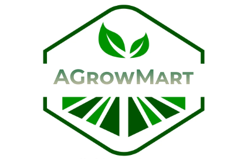

<h1 align="center"><span></span>AgrowMart</h1>
<h2 align="center">We grow when you grow...</h2>

---

## 🤔 What is AgrowMart?

AgrowMart is an innovative online platform with a mission to revolutionize the agricultural sector. Our goal is to empower farmers and provide consumers with convenient access to fresh, nutritious produce. Through AgrowMart, farmers can effortlessly sell their harvests directly to consumers, eliminating middlemen and ensuring fairness in the process. Additionally, we offer farmers personalized recommendations for crops and fertilizers by analyzing their soil data. We utilize advanced technology to detect crop diseases, ultimately enhancing yield and promoting sustainability. AgrowMart's visionary approach seeks to simplify farming, foster sustainable practices, and offer consumers a direct link to the freshest produce.

## 🏁 Getting Started (to run locally)

Follow the steps below, after cloning the repository:

### 🖐 Requirements

**For Installing:**

- Node

**For Running:**

- Create a .env file inside the server folder and then delcare the following variables inside it

  - MONGO_URL="Your mongodb connection string"
  - JWT_KEY = "Your jwt key"

- Go to client/package.json and add the following line:-
  `"proxy":"http://localhost:8000",`
- Go to client/src/api/index.js and change the base url from //TODO to `http://localhost:8000/v1` (at line no. 2)

### ⏳ Installation

- At the root of the project directory, use npm to install the server-side and client-side dependencies

```bash
npm install
```

This command installs all the server-side  and client-side dependencies needed for the website to run locally.

- Use npm to run

```bash
npm run watch
```


This command gets the server running on localhost port 8000 and the client runs on localhost port 3000.

Head over to http://localhost:3000/ and enjoy! 🎉
<br/>

<!-- ### 🌐 Postman Collection

Click below to fork our postman collection and play around with our api

[](https://app.getpostman.com/run-collection/21161585-d244fa0d-a935-4848-b91d-8ae744a3b682?action=collection%2Ffork&collection-url=entityId%3D21161585-d244fa0d-a935-4848-b91d-8ae744a3b682%26entityType%3Dcollection%26workspaceId%3Db6ae606e-00db-4b39-b8a6-136f9150dd47) -->


<!-- ### 🤝 Contributing

Contributions are what make the open source community such an amazing place to be learn, inspire, and create. Any contributions you make are greatly appreciated. The **Issues** tab is a good place to begin!

1. Fork the project repo
2. Clone the forked repo on your machine
3. Create your feature branch (`git checkout -b feature/AmazingFeature`)
4. Commit your changes (`git commit -m 'Add some AmazingFeature'`)
5. Push to the branch on your forked repo (`git push origin feature/AmazingFeature`)
6. Open a pull request -->

## 👻 Testing

The project includes unit tests for testing the routes and controllers, written using jest and supertest.

Run all tests

```bash
npm test
```

## 👨‍💻👩‍💻 Contributors

- [Prakhar Jalan 😎](https://www.linkedin.com/in/jalansprakhar/)
- [Puja Saraf 👩‍💻](https://www.linkedin.com/in/pujaa-saraf/)
- [Shivam Katiyar 🫨](https://www.linkedin.com/in/poojitha-miriyala/)
- [Tanushree 😴](https://www.linkedin.com/in/tanushree-a32849201/)
- [Poojitha Miriyala 👹](https://www.linkedin.com/in/poojitha-miriyala/)

<br>

_(Since AgrowMart is currently hosted on the free tier on render, please give it some time to load it initially)_
